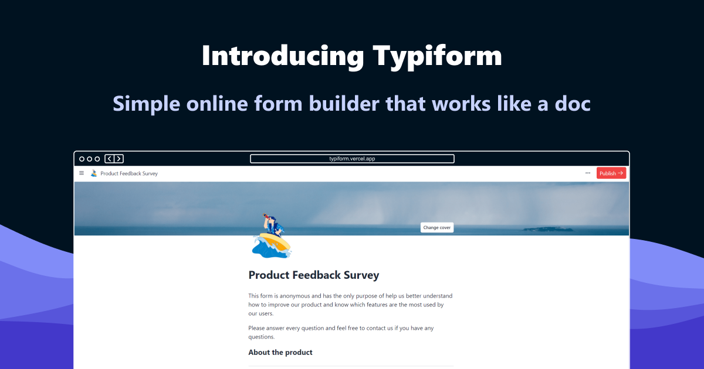
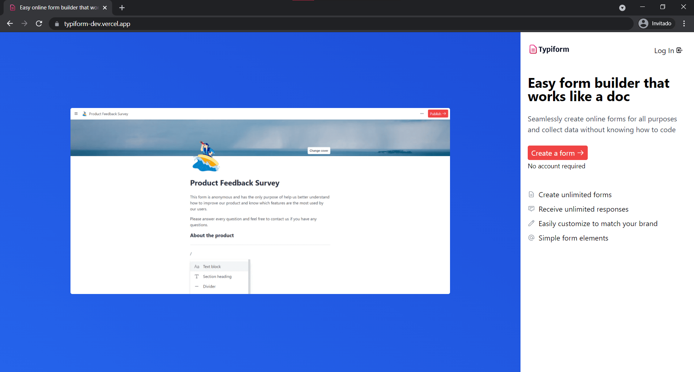
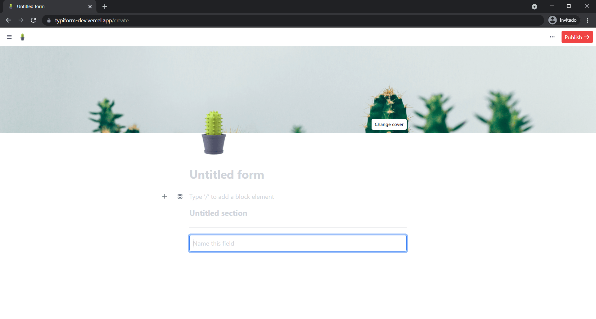
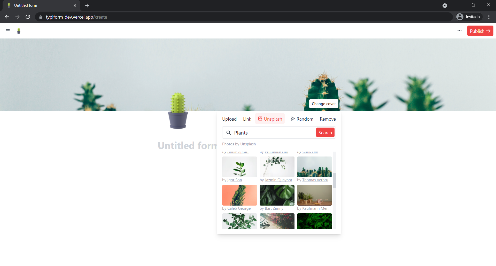
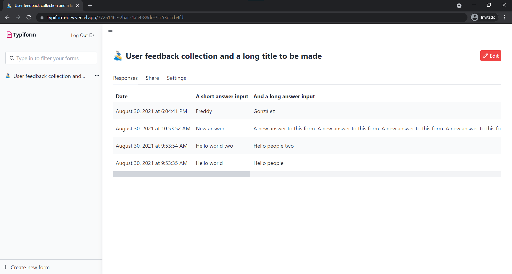
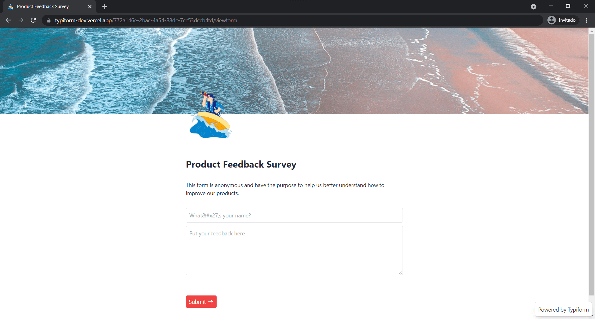

<!-- PROJECT SHIELDS -->

[![Contributors][contributors-shield]][contributors-url]
[![Forks][forks-shield]][forks-url]
[![Stargazers][stars-shield]][stars-url]
[![Issues][issues-shield]][issues-url]
[![MIT License][license-shield]][license-url]
[![LinkedIn][linkedin-shield]][linkedin-url]

<!-- PROJECT LOGO -->
<br />
<p align="center">
  <a href="https://github.com/fredoist/typiform">
    
  </a>

  <h3 align="center">Typiform</h3>

  <p align="center">
    Easy online form builder that works like a doc. Just add form elements as you type and start collecting data.
    <br />
    <a href="https://fredoist.hashnode.dev/introducing-typiform-simple-online-form-builder-that-works-like-a-doc"><strong>Read article on Hashnode »</strong></a>
    <br />
    <br />
    <a href="https://typiform.vercel.app">View Demo</a>
    ·
    <a href="https://github.com/fredoist/typiform/issues">Report Bug</a>
    ·
    <a href="https://github.com/fredoist/typiform/issues">Request Feature</a>
  </p>
</p>

<!-- TABLE OF CONTENTS -->
<details open="open">
  <summary><h2 style="display: inline-block">Table of Contents</h2></summary>
  <ol>
    <li>
      <a href="#about-the-project">About The Project</a>
      <ul>
        <li><a href="#built-with">Built With</a></li>
      </ul>
    </li>
    <li>
      <a href="#getting-started">Getting Started</a>
      <ul>
        <li><a href="#prerequisites">Prerequisites</a></li>
        <li><a href="#installation">Installation</a></li>
      </ul>
    </li>
    <li><a href="#usage">Usage</a></li>
    <li><a href="#roadmap">Roadmap</a></li>
    <li><a href="#contributing">Contributing</a></li>
    <li><a href="#license">License</a></li>
    <li><a href="#contact">Contact</a></li>
    <li><a href="#acknowledgements">Acknowledgements</a></li>
  </ol>
</details>

<!-- ABOUT THE PROJECT -->

## About The Project

[](https://fredoist.hashnode.dev/introducing-typiform-simple-online-form-builder-that-works-like-a-doc)

### Built With

- [React + Next.js](https://nextjs.org)
- [Tailwind CSS](https://tailwindcss.com)
- [Auth0](https://auth0.com)
- [HarperDB](https://harperdb.io)
- [Jotai](https://jotai.pmnd.rs/)

<!-- GETTING STARTED -->

## Getting Started

To get a local copy up and running follow these simple steps.

### Prerequisites

This is an example of how to list things you need to use the software and how to install them.

- npm
  ```sh
  npm install npm@latest -g
  ```

### Installation

1. Clone the repo
   ```sh
   git clone https://github.com/fredoist/typiform.git
   ```
2. Install NPM packages
   ```sh
   npm install
   ```
3. Create a `.env.local` file and add your own variables

   ```sh
   # HarperDB
   HARPERDB_TOKEN=[Your HarperDB Authorization Token]
   HARPERDB_URL=https://example.harperdbcloud.com

   # Unsplash
   UNSPLASH_TOKEN=[Your Unsplash Access Key]
   UNSPLASH_API=https://api.unsplash.com

   # Auth0
   AUTH0_SECRET=[use [openssl rand -hex 32] to generate a 32 bytes value]
   AUTH0_BASE_URL=https://example.com
   AUTH0_ISSUER_BASE_URL=https://example.us.auth0.com
   AUTH0_CLIENT_ID=[Your Auth0 Client ID]
   AUTH0_CLIENT_SECRET=[Your Auth0 Client Secret]
   ```

4. On harperdb you must create a schema named `typiform` and create the following tables
   - `forms` to store form data
   - `responses` to store form response data
5. Run your local dev server by running `npm run dev`

<!-- USAGE EXAMPLES -->

## Screenshots

Landing Page


Form Editor


Unsplash Integration


Dashboard Page


Viewform Page


_For more, please refer to the [Hashnode Article](https://fredoist.hashnode.dev/introducing-typiform-simple-online-form-builder-that-works-like-a-doc)_

<!-- ROADMAP -->

## Roadmap

See the [open issues](https://github.com/fredoist/typiform/issues) for a list of proposed features (and known issues).

<!-- CONTRIBUTING -->

## Contributing

Contributions are what make the open source community such an amazing place to learn, inspire, and create. Any contributions you make are **greatly appreciated**.

1. Fork the Project
2. Create your Feature Branch (`git checkout -b feature/AmazingFeature`)
3. Commit your Changes (`git commit -m 'Add some AmazingFeature'`)
4. Push to the Branch (`git push origin feature/AmazingFeature`)
5. Open a Pull Request

<!-- LICENSE -->

## License

Distributed under the MIT License. See `LICENSE` for more information.

<!-- CONTACT -->

## Contact

Freddy González - [@fredoist](https://twitter.com/fredoist)

Project Link: [https://github.com/fredoist/typiform](https://github.com/fredoist/typiform)

<!-- MARKDOWN LINKS & IMAGES -->
<!-- https://www.markdownguide.org/basic-syntax/#reference-style-links -->

[contributors-shield]: https://img.shields.io/github/contributors/fredoist/typiform.svg?style=for-the-badge
[contributors-url]: https://github.com/fredoist/typiform/graphs/contributors
[forks-shield]: https://img.shields.io/github/forks/fredoist/typiform.svg?style=for-the-badge
[forks-url]: https://github.com/fredoist/typiform/network/members
[stars-shield]: https://img.shields.io/github/stars/fredoist/typiform.svg?style=for-the-badge
[stars-url]: https://github.com/fredoist/typiform/stargazers
[issues-shield]: https://img.shields.io/github/issues/fredoist/typiform.svg?style=for-the-badge
[issues-url]: https://github.com/fredoist/typiform/issues
[license-shield]: https://img.shields.io/github/license/fredoist/typiform.svg?style=for-the-badge
[license-url]: https://github.com/fredoist/typiform/blob/master/LICENSE.txt
[linkedin-shield]: https://img.shields.io/badge/-LinkedIn-black.svg?style=for-the-badge&logo=linkedin&colorB=555
[linkedin-url]: https://linkedin.com/in/fredoist
